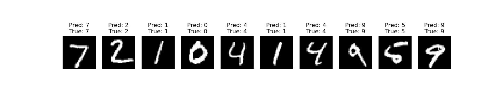
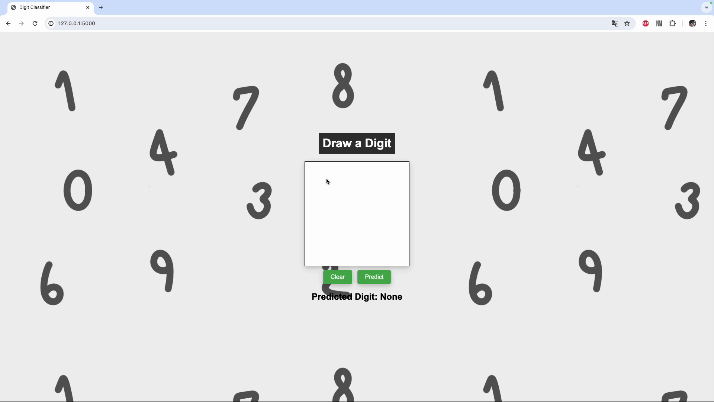

# Digit Classifier Web Application 

This project is a web application that allows users to draw digits on a canvas and classify them using a pre-trained convolutional neural network (CNN) model. The model is trained on the MNIST dataset(not 100 accuracy).

## Prerequisites

- Python 3.x
- Flask
- TensorFlow
- Matplotlib
- Pandas

## Usage

1. **Draw a digit:**
    - Use the mouse to draw a digit on the canvas.
    - Click "Predict" to get the predicted digit.

2. **Clear the canvas:**
    - Click "Clear" to reset the canvas.

## Example Output

### Training Metrics Visualization

### Web Interface

